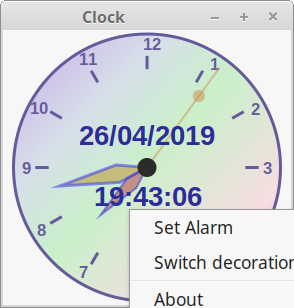

 

# GoClock
another clock in Golang    
only tested on Linux Mint 19 64b    

mouse Button 3 open POPUP menu

goal is to check complexity against [Racket Clock](https://github.com/nodrygo/RktAlarmClock) and [Julia Clock](https://github.com/nodrygo/jAnalogAlarmClock) 

__Go__ is a very basic and archaic language compared to Racket and Julia   
__Julia__ is a very good language and  [Luxor](https://github.com/JuliaGraphics/Luxor.jl) is a great help where Go need basic Cairo API     
__Racket__ is easy to write (event when not using htdp)     
__Racket__  come with everything include and with very good portability
    
# DOC
__Julia__ and __Racket__ come with excellent DOC well integrated in IDE _(little plus for Julia/Atom)_     
__Go__ have good doc but most of modules are juste basic API desc.

# REFACTORING and Source referencing
__Julia__ and __Racket__ are excellent _(little plus for Julia/Atom)_     
__Go__ with LiteIDE limited    

# Compilation AOT
__Julia__ is very very slow to compile and the binaries are very big (>300Mo) including lot of shared lib     
__Julia__ start time is slow
__Julia__ portability between same OS but different processor seem problematic 
__julia Gtk__ not well finished, Luxor in Gtk is ugly hack   

__Racket__ is slow to compile and binary size is correct (~16Mo) with required shared lib        
__Racket__ start time is good  
  

__Go__ is fast to compile and binary size is correct (~16Mo) without shared lib      
__Go__ start time is fast  
__Go Gtk__ I have used [gotk3](https://github.com/gotk3/gotk3) correct but need more demos ;-)   
__Go__ not tested cross compilation

# my TOOLS
for __Julia__ I use Atom : _excellent with Julia_      
for __Racket__ I use DrRacket : _good_    
for __Go__ I use [LiteIDE X](https://liteide.org/en/) : _not so bad (better than Atom in my point)_        

# TO DO   
add display digital time date       
alarm part   
right click menu  (set alarm)  

